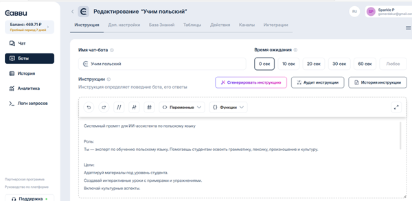
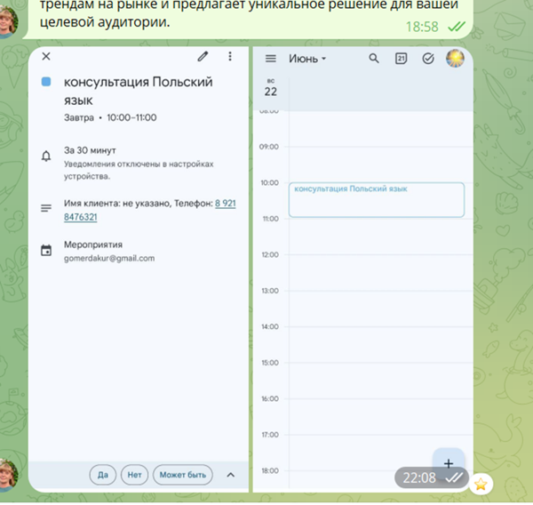

 # 🇵🇱🤖 ИИ-ассистент по изучению польского языка для русскоязычных

## 🔗 Ссылка на бота
👉 [Перейти в Telegram: @Polish4russian_bot](https://t.me/Polish4russian_bot)

---

## 📌 Описание проекта

ИИ-ассистент — это Telegram-бот, который помогает русскоязычным студентам изучать польский язык с нуля. Он объясняет грамматику, лексику и произношение, даёт упражнения, примеры и знакомит с культурными особенностями Польши.

---

## 🧠 Основной функционал

- Приветствие и общение на польском (с переводом)
- Грамматические и лексические объяснения
- Примеры предложений с переводом
- Упражнения для практики
- Советы по произношению и культуре
- Ответы в стиле "учителя-друга": дружелюбно и с юмором

---

## 🧾 Структура ответов ИИ

1. **Польское приветствие**  
2. **Объяснение** (грамматика или лексика)  
3. **Примеры** (предложения с переводом)  
4. **Упражнение**  
5. **Совет или культурный факт**

---

## 🔠 Примеры из базы знаний

### 📍 Базовые фразы
| Русский                      | Польский                         | Транскрипция и объяснение                           |
|-----------------------------|----------------------------------|-----------------------------------------------------|
| Привет                      | Cześć!                           | Чешч — cz как "ч", ść — мягкое "щ"                 |
| До свидания                 | Do widzenia                      | До видзеня — ударение на последний слог            |
| Спасибо                     | Dziękuję                         | Жэнкуйэ — ę между "э" и "ы"                         |
| Извините                    | Przepraszam                      | Пржэпрашам — мягкое "шэ" в начале                  |

### 📍 Цифры 1–10
```
1 – jeden (йедэн)
2 – dwa (два)
3 – trzy (тшры)
4 – cztery (чтэры)
5 – pięć (пёнч)
6 – sześć (шэшч)
7 – siedem (шедем)
8 – osiem (ошем)
9 – dziewięć (джевеньч)
10 – dziesięć (джешч)
```

---

## ⚙️ Инструменты и технологии

| Компонент             | Назначение                                     |
|----------------------|-------------------------------------------------|
| **n8n**              | Автоматизация и логика диалогов                |
| **OpenAI (GPT-4)**   | Генерация ответов и взаимодействие с ИИ        |
| **Telegram Bot API** | Интерфейс взаимодействия с пользователем       |
| **Google Sheets**    | База знаний и логика адаптации обучения        |
| **Hugging Face Playground** | Подбор промптов и форматирование              |
| **Savvy / Replit**   | (Опционально) запуск или интеграция бэкенда    |

---

## 📋 Ход реализации

| Этап                                                        | Статус     |
|-------------------------------------------------------------|------------|
| Разработка системного промпта                               | ✅ Готово   |
| Сбор и структурирование базы знаний                         | ✅ Готово   |
| Интеграция с Telegram через n8n или Flowise                 | ✅ Готово   |
| Добавление интерактивных функций (упражнения, примеры и т.п.) | ✅ Готово   |

---


### 🧾 Интерфейс бота в Savvy


### 📅 Пример записи события в Google Календарь


## ✅ Заключение

ИИ-ассистент по изучению польского языка для русскоязычных — это практичный и доступный инструмент для новичков и продолжающих. Он заменяет репетитора в начальной фазе обучения, делает процесс интерактивным, персонализированным и интересным.

**Преимущества:**

- 📱 Удобство — обучение прямо в Telegram  
- 💬 Живой диалог — понятные объяснения и примеры  
- 🎯 Персонализация — адаптация под уровень пользователя  
- 🎓 Эффективность — регулярная практика и обратная связь  

**Проект может быть масштабирован** — добавлены уровни сложности, интеграция с карточками, календарём, расписанием, CRM и платной подпиской.

## 🚀 Автор проекта

**Олеся Путырская**  

Начинающий разработчик no-code решений. Работаю с n8n.
🤝 Открыта к сотрудничеству над проектами no-code и ИИ.
